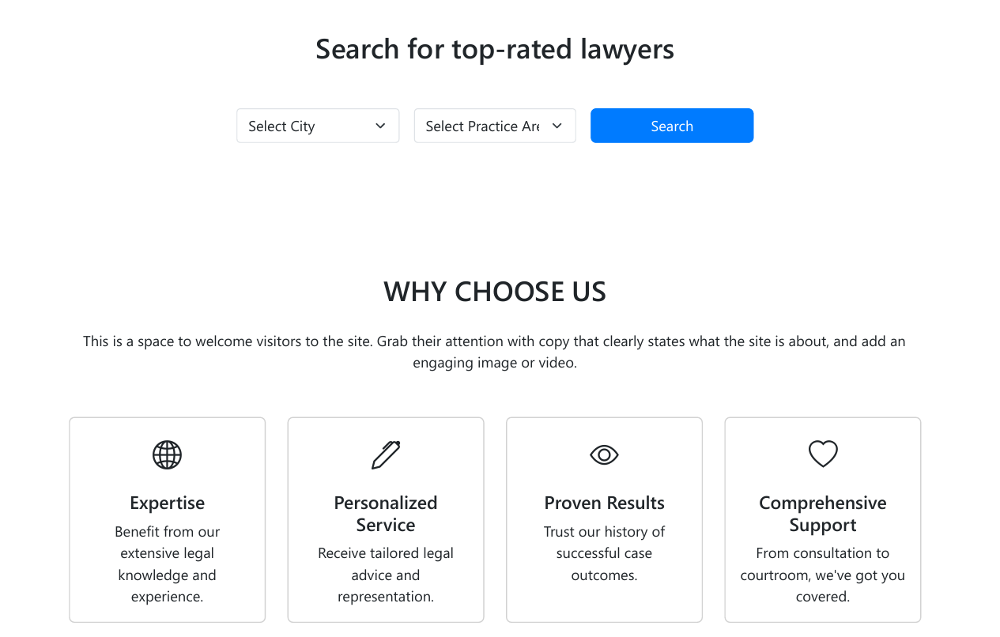
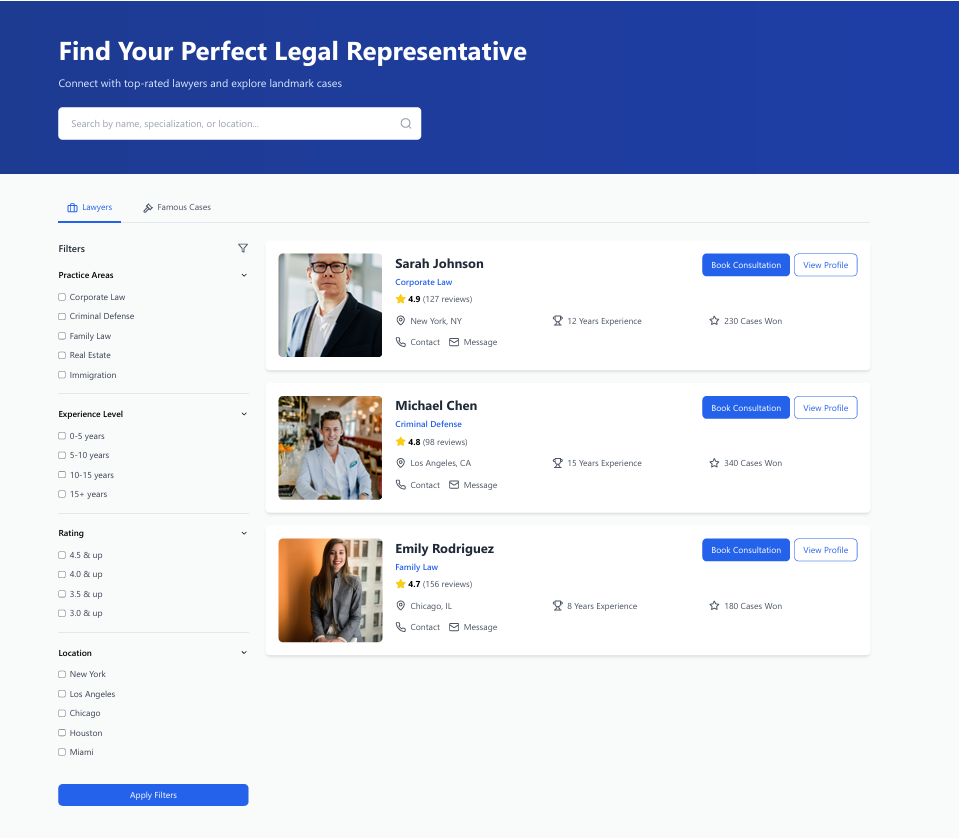

# Bharatiya Kanoon: Legal Service Platform  

**Bharatiya Kanoon** is an innovative legal service platform designed to make legal services more accessible and streamline client-lawyer interactions. It allows users to easily search and connect with top-rated lawyers in India, providing a seamless experience for finding legal assistance.

---

## 📌 Features  

### User Features  
- **Find Lawyers**: Search and filter lawyers based on location, expertise, ratings, and experience.  
- **Book Consultation**: Schedule consultations with lawyers directly through the platform.  
- **User Reviews**: Rate and leave reviews for lawyers based on your experience.  

### Admin Features  
- **Add/Manage Lawyers**: Admins can add, update, or remove lawyer profiles, manage specialization areas, availability, and more.  
- **Database Management**: Reliable and secure database management of user and lawyer data.  

### Future Features  
- **API Integration**: Develop an API to provide legal services data to other third-party platforms for integration and business opportunities.  
- **Payment Gateway**: A secure payment system for paying lawyer consultation fees.  
- **Legal Resources**: Access to educational articles, legal guides, templates, and resources for users.  

---

## 🛠️ Technology Stack  

- **Frontend**:  
   - React.js  
   - HTML  
   - Bootstrap  
   - JavaScript  

- **Backend**:  
   (To be developed – possible technologies include:)  
   - Node.js  
   - Express.js  
   - MySQL or MongoDB  

- **Development Tools**:  
   - Visual Studio Code  
   - GitHub  

- **Version Control**:  
   - Git  

---

## 🚀 Getting Started  

### Prerequisites  

Before you begin, ensure you have the following tools installed:

1. **Node.js** (LTS version recommended) – [Download here](https://nodejs.org/).  
2. **npm** (Node Package Manager) – Comes with Node.js.

### Installation  

To get the project up and running on your local machine, follow these steps:

1. **Clone the repository**:  
   ```bash  
   git clone https://github.com/your-username/bharatiya-kanoon.git  
   ```

2. **Navigate to the project directory**:  
   ```bash  
   cd bharatiya-kanoon  
   ```

3. **Install dependencies**:  
   Run the following command to install the necessary npm packages:  
   ```bash  
   npm install  
   ```

4. **Run the development server**:  
   Start the app by running:  
   ```bash  
   npm start  
   ```  
   This will open the app in your browser, typically at `http://localhost:3000`.

---

## 📸 Screenshots  

Here are some screenshots of the website's key pages:

### Homepage  


### Lawyer Search Page  


### Lawyer Profile Page  


---

## 🤝 Contributing  

Contributions are welcome! If you want to help develop the backend, improve the frontend, or add new features, feel free to contribute. Here are the steps to get started:

1. **Fork the repository**:  
   Click the "Fork" button on the top right of the repository page to create a copy of the project in your GitHub account.

2. **Create a new branch**:  
   ```bash  
   git checkout -b feature-name  
   ```

3. **Make your changes**:  
   Implement the feature or bug fix you want to add.

4. **Commit your changes**:  
   ```bash  
   git commit -m "Add feature description"  
   ```

5. **Push to your branch**:  
   ```bash  
   git push origin feature-name  
   ```

6. **Submit a pull request**:  
   Open a pull request on the original repository to propose your changes.

---

## 💡 Future Plans  

- **Backend Development**: The backend will be built using Node.js and Express.js, allowing for secure authentication, lawyer and user data management, and API integration.  
- **API Development**: A public API will be developed to allow third-party services to access lawyer data and integrate it into their own platforms for a fee.  
- **Monetization**: Once the platform is fully developed, the data can be sold to other businesses or platforms through API access.  
- **Payment System**: We plan to integrate a secure payment gateway for booking consultations and handling transactions between users and lawyers.  
- **Legal Resource Center**: Develop a section for educational content, templates, and articles that can help users understand common legal procedures and terms.

---

## 📝 License  

This project is licensed under the **MIT License**. You are free to use, modify, and distribute this project as long as you include proper attribution.

---

Feel free to check out the [GitHub repository](https://github.com/your-username/bharatiya-kanoon) for more details!

---
```

### Additional Notes:

- **Backend Development**: You can specify more backend details once it's started (e.g., database schema, API documentation).
- **Monetization**: The section mentions API access for future monetization. You can further expand this as you move toward creating APIs and charging for access.
- **Contributions**: This section outlines how others can contribute, which is helpful for open-source collaboration.

Let me know if you'd like to further refine this or if you need help with the backend development!
